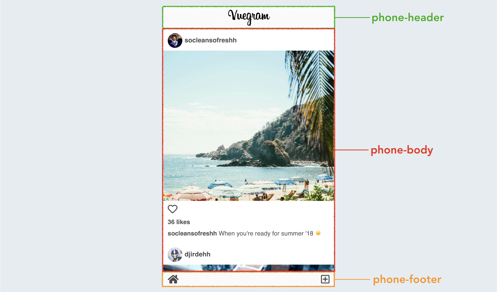
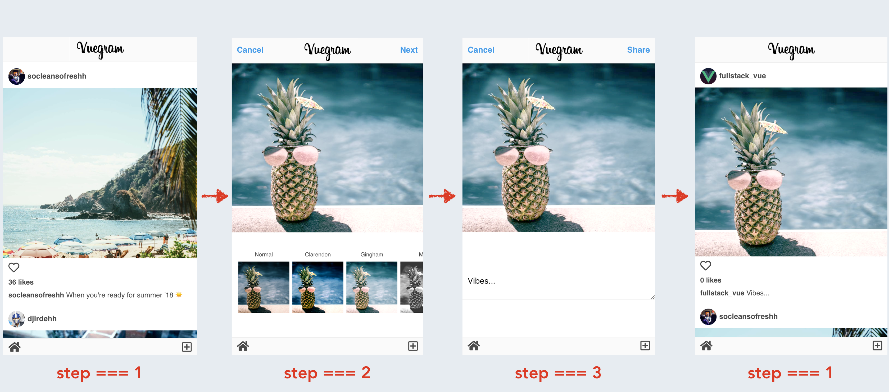
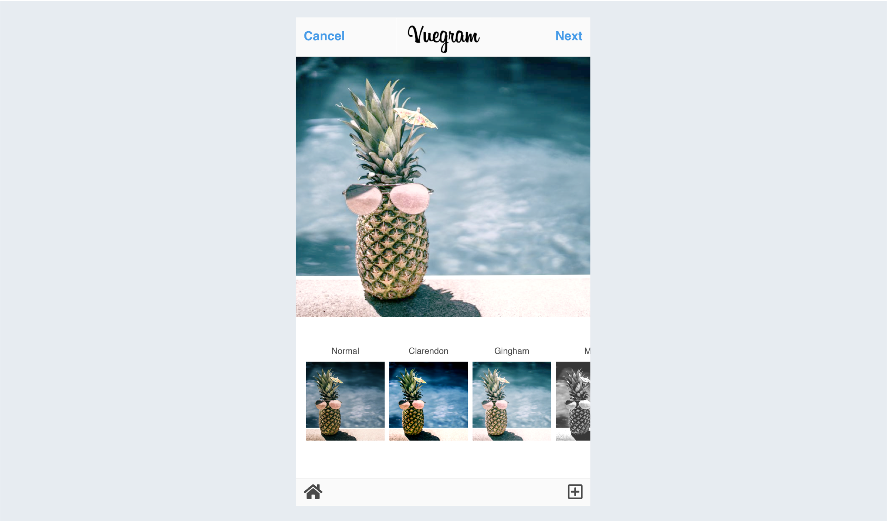
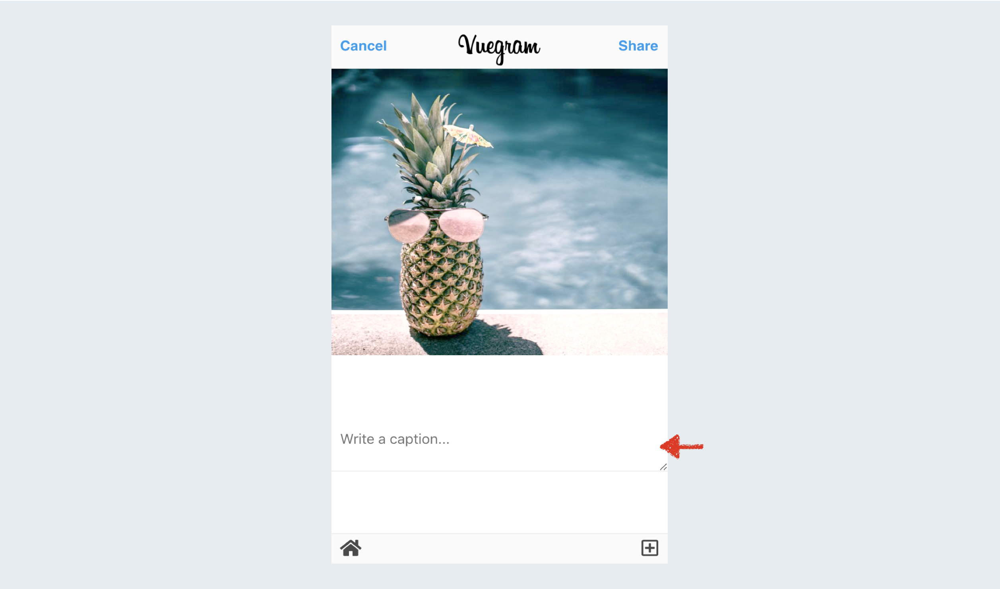

# React Instagram Clone

## 1. Домашняя страница

Первое, что мы начнем делать - это создавать ленту постов Главной страницы.

На высоком уровне мы можем разбить компоновку будущего приложения на три раздела: шапку (header), тело (body) и подвал (footer).

Большинство функциональных возможностей приложения будут находится в секции body; поэтому было бы целесообразно создать отдельный компонент, который представлял бы этот раздел.

Перед продолжением, давайте разберемся какой функционал “лайков” нужно будет добавить для постов Instagram. В реальном Instagram мы можем добавить в избранное щелкнув по иконке сердца под изображением поста или дважды щелкнув это изображение.

likes - это число, которое мы будем увеличивать на один, когда пользователь «лайкает» пост. Поскольку мы не будем позволять пользователю постоянно увеличивать количество лайков к одному и тому же посту, hasBeenLiked будет той переменной логического типа, которая будет показывать лайкнут ли пост.

## 2. Процесс отправки

Когда пользователь начинает процесс отправки, мы хотим изменять UI (пользовательский интерфейс) в зависимости от того, где находится пользователь (например, если пользователь находится на втором этапе, ему/ей должно быть предложено выбрать фильтр, который должен быть применен к изображению).

## 3. Экран фильтра

Предварительный просмотр изображения и список фильтров.
Когда пользователь загружает изображение и направляется на 2 этап, мы хотим отобразить выбранное изображение и фильтры, которые можно применить к нему.

#### Выбор фильтра
Мы хотим дать пользователю возможность выбрать фильтр, который приведет к включению фильтра в расширенный предварительный просмотр изображения.

#### Навигация вперед
Единственное, что осталось на этом этапе, это создать элементы навигации, чтобы пользователь мог перейти к 3 шагу или отменить процесс отправки.
В меню мы хотим вывести «Cancel» и «Next», когда пользователь находится на 2 шаге.

## 4. Завершение процесса оправки сообщения

#### Захват контента
Когда пользователь находится на 3 шаге, мы хотим отобразить предварительный просмотр изображения, но в этом случае также присутствует вход в textarea, где мы можем позволить пользователю отправить подпись в свой пост.

#### Публикация поста
Чтобы завершить отправку поста, мы должны предоставить пользователю возможность публиковать пост по клику на ссылку «Share».

## 5. Дополнительные функции.
Здесь вы можете добавить недостающие функции инстаграма. Например, поиск по хэш-тегам.